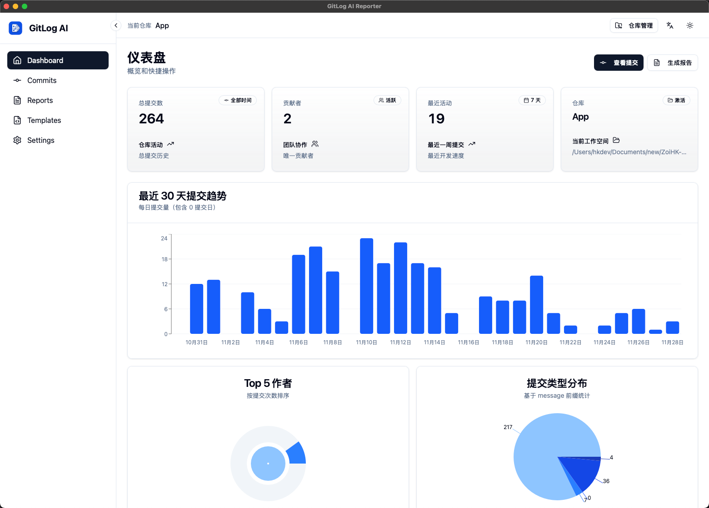
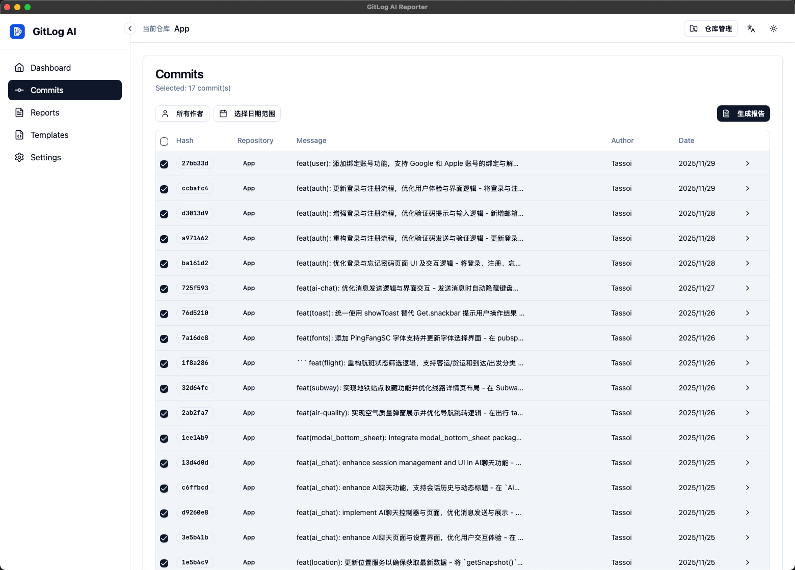
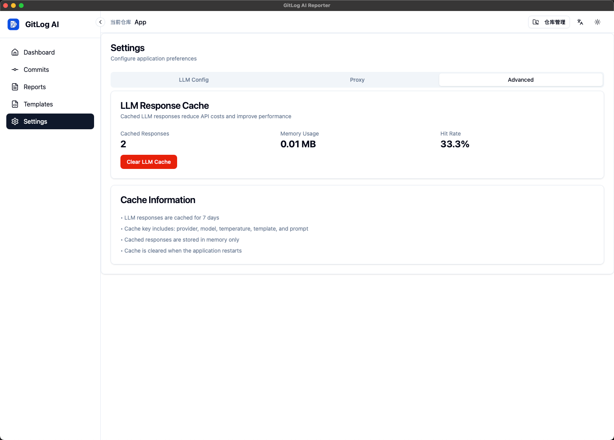
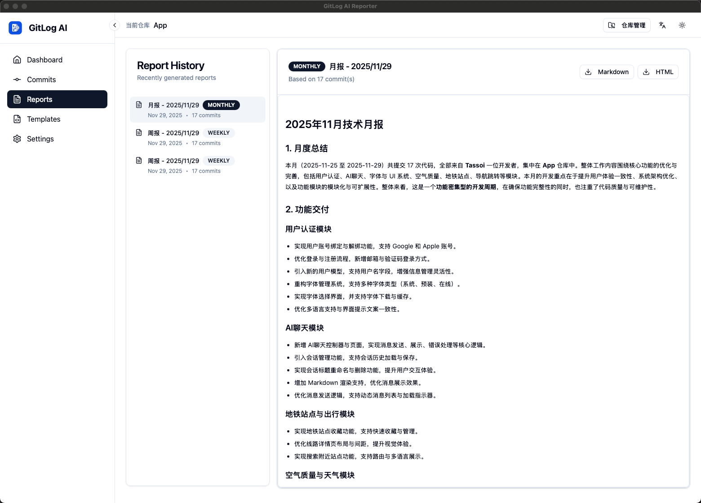

# Commitly

<div align="center">


**用 AI 将你的 Git 提交转化为专业报告**

一款轻量级桌面应用，使用 LLM 技术自动从 Git 仓库生成周报/月报。

[](https://reactjs.org/)
[](https://www.typescriptlang.org/)
[](https://tauri.app/)
[](https://www.rust-lang.org/)
[](https://vitejs.dev/)
[](https://tailwindcss.com/)
[](LICENSE)

[English](README.md) | 简体中文

[功能特性](#功能特性) • [安装](#安装) • [使用](#使用) • [技术栈](#技术栈) • [开发](#开发) • [许可证](#许可证)

</div>

---

## ✨ 功能特性

### 🚀 核心功能

- **多仓库支持**：同时管理多个 Git 仓库，自动恢复上次会话
- **AI 驱动报告**：使用 OpenAI、Claude、Gemini 或本地 LLM 模型生成周报/月报
- **智能提交分析**：按作者、日期范围和仓库筛选提交
- **自定义模板**：使用 Handlebars 语法创建和管理报告模板
- **实时流式生成**：实时观看报告生成过程
- **多种导出格式**：支持导出为 Markdown、HTML 或 PDF

### 🎨 用户体验

- **现代化界面**：基于 shadcn/ui 和 Tailwind CSS 构建的简洁响应式界面
- **深色/浅色模式**：完整的主题支持，可跟随系统偏好
- **国际化**：支持中文和英文（易于扩展）
- **全局仓库访问**：通过顶部栏随时管理仓库
- **持久化状态**：启动时自动恢复上次会话

### 🔒 安全与隐私

- **本地优先**：所有数据存储在本地
- **安全的 API 密钥**：凭证存储在系统密钥环中（计划中）
- **无遥测**：除非使用云端 LLM 服务，否则数据不会离开你的电脑

---

## 📦 安装

### 前置要求

- **Node.js** 18+ 和 npm
- **Rust** 1.70+（从源码构建时需要）
- 系统已安装 **Git**

### 快速开始

1. **克隆仓库**

```bash
git clone https://github.com/Tassoi/Commitly.git
cd Commitly
```

2. **安装依赖**

```bash
npm install
```

3. **开发模式运行**

```bash
npm run tauri dev
```

### 生产环境构建

```bash
# 构建应用
npm run tauri build

# 输出文件位于 src-tauri/target/release/bundle/
# - Windows: .msi / .exe
# - macOS: .dmg / .app
# - Linux: .deb / .AppImage
```

---

## 🎯 使用

### 入门指南

1. **打开仓库**
   - 点击顶部栏的"仓库管理"按钮
   - 选择"打开新仓库"并选择你的 Git 仓库文件夹
   - 应用将加载最近 30 天的提交记录

2. **选择提交**
   - 导航到"提交"页面
   - 使用筛选器按作者、日期或仓库缩小提交范围
   - 选择要包含在报告中的提交

3. **生成报告**
   - 点击"生成报告"按钮
   - 选择报告类型（周报/月报）
   - 选择模板
   - 实时观看 AI 生成报告

4. **导出与分享**
   - 在"报告"页面查看生成的报告
   - 导出为 Markdown、HTML 或 PDF（TODO）
   - 与团队或经理分享（TODO）

### 配置

#### LLM 设置

在设置中配置你偏好的 LLM 提供商：

- **OpenAI**：GPT-4、GPT-3.5-turbo
- **Anthropic**：Claude 3 Opus、Sonnet、Haiku
- **Google**：Gemini Pro

#### 自定义模板

创建自定义报告模板：

1. 前往模板页面
2. 点击"创建模板"
3. 可以参考已经存在的默认模版 使用对应的变量：

- 涉及仓库数：{{total_repos}}
- 提交总数：{{total_commits}}
- 时间范围：{{date_range}}
- 作者数：{{unique_authors}}）
- ...

---

## 🛠 技术栈

### 前端

- **框架**：React 18 + TypeScript
- **状态管理**：Zustand（带持久化）
- **UI 组件**：shadcn/ui + Radix UI
- **样式**：Tailwind CSS
- **路由**：React Router v6
- **国际化**：i18next + react-i18next
- **图表**：Recharts
- **日期处理**：date-fns

### 后端

- **框架**：Tauri 1.5+
- **语言**：Rust 1.70+
- **Git 集成**：git2-rs
- **HTTP 客户端**：reqwest
- **模板引擎**：Handlebars
- **异步运行时**：tokio
- **序列化**：serde

### 构建工具

- **前端**：Vite
- **后端**：Cargo
- **代码检查**：Prettier
- **类型检查**：TypeScript

---

## 🔧 开发

### 项目结构

```
Commitly/
├── src/                          # 前端源码
│   ├── components/              # React 组件
│   │   ├── CommitList/         # 带筛选的提交列表
│   │   ├── navigation/         # TopBar、SideNav
│   │   └── ui/                 # shadcn/ui 组件
│   ├── pages/                   # 页面组件
│   │   ├── Dashboard/          # 概览和统计
│   │   ├── Commits/            # 提交管理
│   │   ├── Reports/            # 报告查看器
│   │   ├── Templates/          # 模板编辑器
│   │   └── Settings/           # 应用配置
│   ├── store/                   # Zustand 状态管理
│   │   ├── repoStore.ts        # 仓库状态
│   │   ├── reportStore.ts      # 报告状态
│   │   └── uiStore.ts          # UI 偏好设置
│   ├── hooks/                   # 自定义 React Hooks
│   ├── i18n/                    # 国际化
│   │   └── locales/            # 翻译文件
│   └── types/                   # TypeScript 类型定义
│
├── src-tauri/                   # Rust 后端
│   ├── src/
│   │   ├── commands/           # Tauri 命令处理器
│   │   │   ├── git.rs          # Git 操作
│   │   │   ├── llm.rs          # LLM 集成
│   │   │   ├── report.rs       # 报告生成
│   │   │   └── template.rs     # 模板管理
│   │   ├── services/           # 业务逻辑
│   │   │   ├── git_service.rs  # Git 仓库处理
│   │   │   ├── llm_service.rs  # LLM API 调用
│   │   │   └── template_service.rs
│   │   ├── models/             # 数据结构
│   │   └── main.rs             # 应用入口
│   └── templates/              # 内置报告模板
│
├── public/                      # 静态资源
├── CLAUDE.md                    # AI 项目指南
└── README.md                    # 本文件
```

### 可用脚本

```bash
# 开发
npm run dev              # 仅启动 Vite 开发服务器
npm run tauri dev        # 启动完整 Tauri 应用（带热重载）

# 构建
npm run build            # 构建生产环境前端
npm run tauri build      # 构建完整桌面应用

# 代码质量
npm run format           # 使用 Prettier 格式化代码
npm run type-check       # 运行 TypeScript 编译器检查

# Rust
cd src-tauri
cargo check              # 检查 Rust 代码
cargo test               # 运行 Rust 测试
cargo clippy             # 运行 Rust 代码检查
```

### 添加新功能

1. **前端组件**：添加到 `src/components/` 或 `src/pages/`
2. **后端命令**：添加到 `src-tauri/src/commands/`
3. **翻译**：更新 `src/i18n/locales/zh.ts` 和 `en.ts`
4. **类型定义**：在 `src/types/index.ts` 中定义

### 贡献

欢迎贡献！请遵循以下步骤：

1. Fork 本仓库
2. 创建特性分支（`git checkout -b feature/amazing-feature`）
3. 提交你的更改（`git commit -m 'Add amazing feature'`）
4. 推送到分支（`git push origin feature/amazing-feature`）
5. 开启 Pull Request

---

## 📸 截图

### 仪表盘


_仓库统计和最近活动概览_

### 报告生成


_实时 AI 驱动的报告生成（带流式输出）_

### 模板管理


_创建和自定义报告模板_

### 设置


_配置 LLM 提供商和应用偏好_

---

## 🗺 路线图

- [ ] **安全增强**
  - [ ] 系统密钥环集成存储 API 密钥
  - [ ] 加密配置存储
  - [ ] 安全文件权限

- [ ] **高级功能**
  - [ ] 报告中的提交差异分析
  - [ ] 团队协作功能
  - [ ] 报告调度和自动化
  - [ ] 报告中的自定义图表类型

- [ ] **集成**
  - [ ] GitHub/GitLab API 集成
  - [ ] Slack/Discord 通知
  - [ ] 邮件报告发送

- [ ] **性能优化**
  - [ ] 大型仓库的增量 Git 解析
  - [ ] LLM 响应缓存
  - [ ] 虚拟滚动优化

---

## 🐛 已知问题

- PDF 导出需要单独安装 wkhtmltopdf
- 大型仓库（10k+ 提交）初次加载可能需要时间
- 某些 LLM 提供商可能有速率限制

---

## 📄 许可证

本项目采用 MIT 许可证 - 详见 [LICENSE](LICENSE) 文件。

---

## 🙏 致谢

- [Tauri](https://tauri.app/) - 出色的桌面应用框架
- [shadcn/ui](https://ui.shadcn.com/) - 精美的 UI 组件
- [git2-rs](https://github.com/rust-lang/git2-rs) - Git 集成
- 所有让这个项目成为可能的开源贡献者

---

## 📧 联系方式

- **问题反馈**：[GitHub Issues](https://github.com/Tassoi/Commitly/issues)
- **讨论交流**：[GitHub Discussions](https://github.com/Tassoi/Commitly/discussions)

---

<div align="center">

**由开发者制作，为开发者服务 ❤️**

⭐ 如果觉得有帮助，请给个 Star！

</div>
